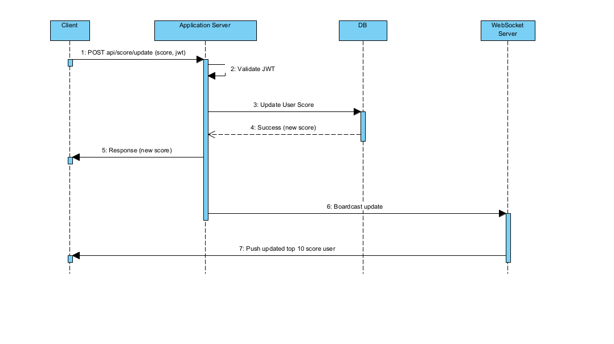

# Scoreboard API Service

## Overview

This module provides backend APIs support for a **real-time scoreboard** that displays the **Top 10 user scores** on a website.

It ensures: - Scores are updated when a user completes an action. - The scoreboard is live-updated across all clients. - Security measures are in place to prevent unauthorized score manipulation.

## Features

1. **Scoreboard API**
   - Fetch top 10 users by score
   - Update user's score after completing an authorized action.
2. **Real-time Updates**
   - Push updates to connected clients via WebSocket
3. **Security**
   - Request must be authenticated with JWT

## API Endpoints Specifications

**Update User Score**
This endpoint is used to increment a user's score after validated action. - URL: /api/score/update - Method: POST - Content-Type: application/json

**Headers**
| Header           | Type             | Description                          | Required |
| ---------------- | ---------------- | ------------------------------------ | -------- |
| Authorization    | String           | Bearer token for user authentication | Yes |

**Request Body**
| Field            | Type             | Description                          | Required |
| ---------------- | ---------------- | ------------------------------------ | -------- |
| score            | String           | The positive integer value           | Yes      |

**Example Request**

```bash
{
  "score": 1
}
```

**Responses** 
    - Success (200 OK): Returned when score is updated successfully

```bash
{
"success": true,
"message": "Score updated successfully."
}
```
    - Bad Request (400 Bad Request): Returned if the request body is invalid (e.g., score is missing or not a positive integer).

```bash
{
"success": false,
"message": "Invalid scoreIncrement value."
}
```
    - Unauthorized (401 Unauthorized): Returned if the JWT is missing, invalid, or expired.
```bash
{
"success": false,
"message": "Authentication failed."
}
```

**Execution Flow**


**Improvements**
    - **Rate Limiting**: Implement rate limiting to prevent users from spamming update requests in a short period.
    - **Scalability**: Use Redis pub/sub for broadcasting updates across multiple app server instances.

